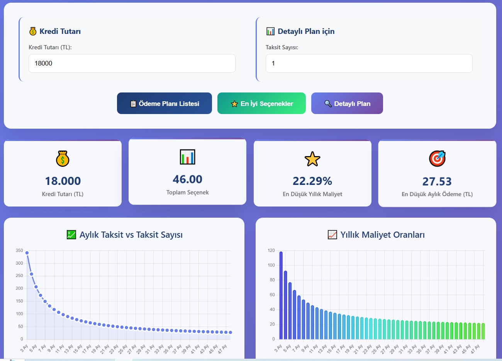
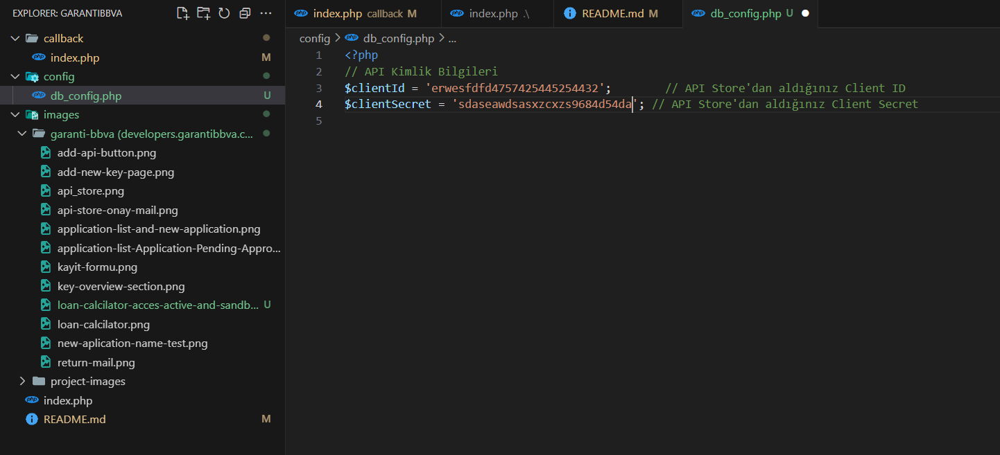
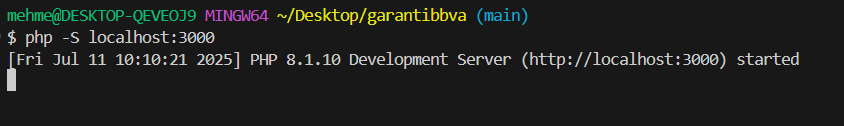
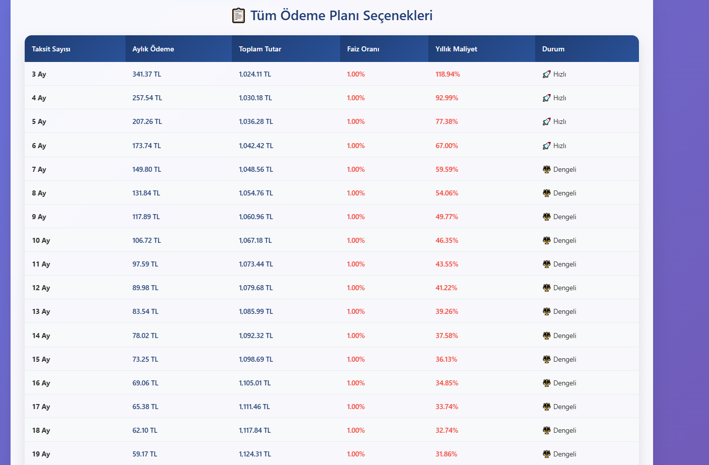
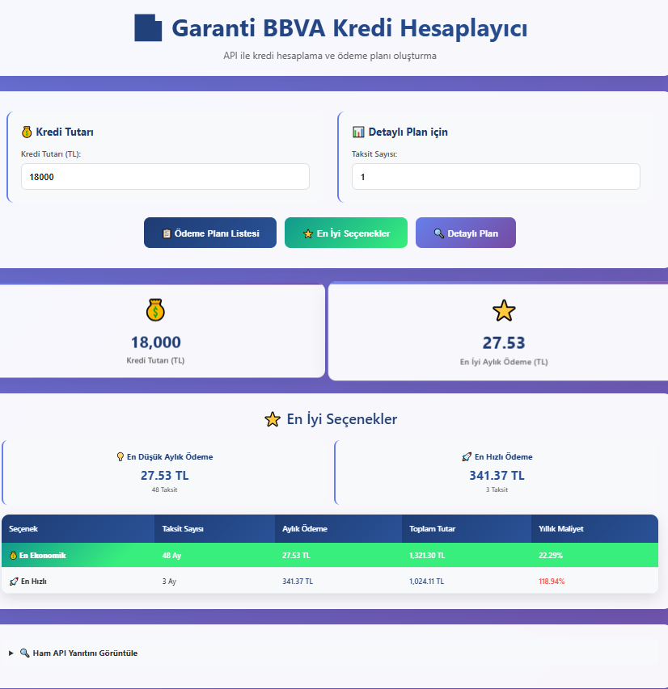
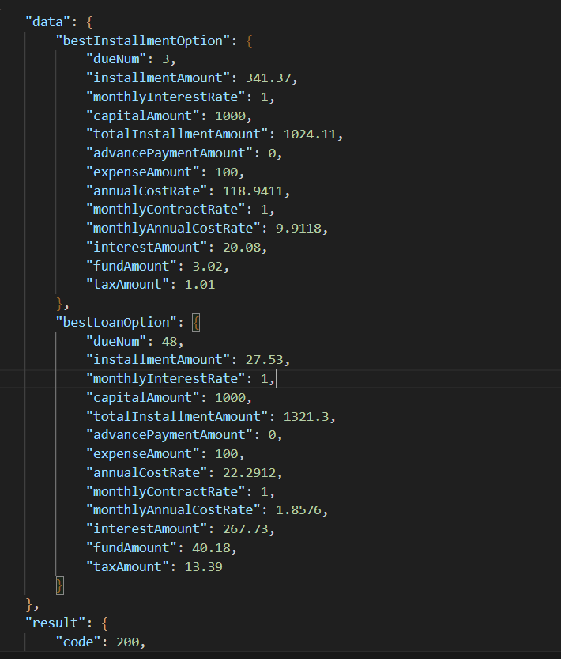

# 🏦 Garanti BBVA API Loan Calculator Test Data Project

Bu proje, Garanti BBVA API Store'dan Loan Calculator API'sını kullanarak kredi hesaplama işlevselliği sunan bir PHP uygulamasıdır.



## 📋 İçindekiler

- [Özellikler](#özellikler)
- [Gereksinimler](#gereksinimler)
- [API Kayıt İşlemi](#api-kayıt-işlemi)
- [Kurulum](#kurulum)
- [Yapılandırma](#yapılandırma)
- [Kullanım](#kullanım)
- [API Dokümantasyonu](#api-dokümantasyonu)
- [Test Verileri](#test-verileri)
- [Sorun Giderme](#sorun-giderme)
- [Katkıda Bulunma](#katkıda-bulunma)

## ⭐ Özellikler

- 💰 Kredi tutarı hesaplama
- 📊 Aylık taksit miktarı belirleme
- 🔐 OAuth 2.0 kimlik doğrulama
- 🧪 Test ortamı (Sandbox) desteği
- 📱 Responsive tasarım
- 🚀 Kolay kurulum ve kullanım

## 🔧 Gereksinimler

- PHP 7.4 veya üzeri
- cURL desteği
- JSON desteği
- Web sunucusu (Apache/Nginx) veya PHP'nin built-in sunucusu

## 🔑 API Kayıt İşlemi

### 1. Garanti BBVA API Store'a Kayıt Olma

/kayit-formu.png)

1. [developers.garantibbva.com.tr](https://developers.garantibbva.com.tr) adresine gidin
2. Sağ üst köşedeki **"KAYIT OL"** butonuna tıklayın
3. Formu doldurun:
   - Ad Soyad
   - E-posta adresi
   - Şifre
   - Şirket bilgileri (opsiyonel)
_________________________________________________________________________________________________________


/api-store-onay-mail.png)

_________________________________________________________________________________________________________
4. E-posta adresinize gelen aktivasyon linkini tıklayın

### 2. Uygulama Oluşturma

/application-list-and-new-application.png)

1. Giriş yaptıktan sonra **"Manage → Applications"** seçeneğine tıklayın
2. **"Add Application"** butonuna tıklayın
3. Uygulama bilgilerini doldurun:
   - **Application Name**: Loan Calculator Test App
   - **Description**: Kredi hesaplama test uygulaması

/new-aplication-name-test.png)

### 3. Platform Seçimi

/new-aplication-name-test.png)
Custom Fields aşamasında platform olarak **"Hybrid"** seçin.

### 4. API Seçimi

/loan-calcilator-acces-active-and-sandbox-active.png)
1. **"API Management"** aşamasında **"Loan Calculator"** API'sını seçin
2. Hüküm & Koşulları kabul edin
3. **"Next"** butonuna tıklayın

### 5. Authentication Ayarları

/add-new-key-page.png)

1. **Callback URL**: `https://yourdomain.com/callback` (geliştirme için `http://localhost:3000/callback`)
2. **Scope**: `OOB`
3. **Type**: `Confidential`
4. **"Submit Request"** butonuna tıklayın

### 6. Client Credentials Alma

/key-overview-section.png)

Bu aşamada **Client ID** ve **Client Secret** bilgileriniz otomatik olarak üretilecektir. Bu bilgileri güvenli bir yerde saklayın!

```
Client ID: l7edc5187a3ac348c091b9d042xxxxxxxx
Client Secret: fc9d4c464f86432fbef45744xxxxxxxx
```

## 🚀 Kurulum

### 1. Projeyi İndirme

```bash
git clone https://github.com/mehmetdogandev/garantibbva-API-Loan-Calculator-test-data-project.git
cd garantibbva-API-Loan-Calculator-test-data-project
```

### 2. Bağımlılıkları Kontrol Etme

PHP'nizin gerekli extension'ları kontrol edin:

```bash
php -m | grep -E "(curl|json)"
```

## ⚙️ Yapılandırma

### API Kimlik Bilgilerini Güncelleme

`db_config.php` dosyasını açın ve aşağıdaki değerleri güncelleyin:

```php
<?php
// API Kimlik Bilgileri
$clientId = 'YOUR_CLIENT_ID';        // API Store'dan aldığınız Client ID
$clientSecret = 'YOUR_CLIENT_SECRET'; // API Store'dan aldığınız Client Secret

?>
```



### Gerçek API Bilgilerinizi Yerleştirme

1. Garanti BBVA API Store'dan aldığınız **Client ID**'yi `YOUR_CLIENT_ID` yerine yazın
2. **Client Secret**'ı `YOUR_CLIENT_SECRET` yerine yazın

**Örnek:**
```php
$clientId = 'erwesfdfd4757425445254432'; 
$clientSecret = 'sdaseawdsasxzcxzs9684d54da';
```

## 🏃‍♂️ Çalıştırma

### PHP Built-in Sunucusu ile Çalıştırma

Projenin ana dizininde terminal açın ve aşağıdaki komutu çalıştırın:

```bash
php -S localhost:3000
```



**Not:** Port 3000 kullanımda ise farklı bir port kullanabilirsiniz: ancak o zaman api yi oluştururken de o portu seçtirmeniz gerekiyor.

```bash
php -S localhost:8080
php -S localhost:8000
```

### Uygulamaya Erişim

Tarayıcınızı açın ve şu adrese gidin:

```
http://localhost:3000
```


## 💻 Kullanım

### 1. Access Token Alma

Uygulama otomatik olarak OAuth 2.0 akışını başlatacaktır:

```php
function getAccessToken($clientId, $clientSecret, $authUrl, $callbackUrl) {
    $postData = [
        'grant_type' => 'client_credentials',
        'client_id' => $clientId,
        'client_secret' => $clientSecret,
        'redirect_uri' => $callbackUrl
    ];
    
    $ch = curl_init();
    curl_setopt($ch, CURLOPT_URL, $authUrl);
    curl_setopt($ch, CURLOPT_POST, true);
    curl_setopt($ch, CURLOPT_POSTFIELDS, http_build_query($postData));
    curl_setopt($ch, CURLOPT_HTTPHEADER, [
        'Content-Type: application/x-www-form-urlencoded'
    ]);
    curl_setopt($ch, CURLOPT_RETURNTRANSFER, true);
    
    $response = curl_exec($ch);
    curl_close($ch);
    
    return json_decode($response, true);
}
```

### 2. Kredi Hesaplama



Formu doldurarak kredi hesaplaması yapabilirsiniz:

- **Kredi Tutarı**: 10.000 - 500.000 TL arası
- **Vade**: 12 - 120 ay arası
- **Faiz Oranı**: Yıllık faiz oranı

```php
function calculateLoan($accessToken, $amount, $term, $interestRate) {
    $apiUrl = "https://apis.garantibbva.com.tr/loan-calculator/v1/calculate";
    
    $postData = [
        'loanAmount' => $amount,
        'termInMonths' => $term,
        'interestRate' => $interestRate
    ];
    
    $ch = curl_init();
    curl_setopt($ch, CURLOPT_URL, $apiUrl);
    curl_setopt($ch, CURLOPT_POST, true);
    curl_setopt($ch, CURLOPT_POSTFIELDS, json_encode($postData));
    curl_setopt($ch, CURLOPT_HTTPHEADER, [
        'Authorization: Bearer ' . $accessToken,
        'Content-Type: application/json'
    ]);
    curl_setopt($ch, CURLOPT_RETURNTRANSFER, true);
    
    $response = curl_exec($ch);
    curl_close($ch);
    
    return json_decode($response, true);
}
```

### 3. Sonuçları Görüntüleme



API'den dönen yanıt şu formatta olacaktır:

```json
{
    "monthlyPayment": 2543.87,
    "totalAmount": 305264.40,
    "totalInterest": 55264.40,
    "effectiveRate": 1.45
}
```

## 📚 API Dokümantasyonu

### Authentication Endpoint

```
POST https://apis.garantibbva.com.tr/auth/oauth/v2/token
```

**Request Body:**
```json
{
    "grant_type": "client_credentials",
    "client_id": "YOUR_CLIENT_ID",
    "client_secret": "YOUR_CLIENT_SECRET",
    "redirect_uri": "YOUR_CALLBACK_URL"
}
```

**Response:**
```json
{
    "access_token": "eyJhbGciOiJSUzI1NiIsInR5cCI6IkpXVCJ9...",
    "token_type": "Bearer",
    "expires_in": 3600
}
```

### Loan Calculator Endpoint

```
POST https://apis.garantibbva.com.tr/loan-calculator/v1/calculate
```

**Headers:**
```
Authorization: Bearer {access_token}
Content-Type: application/json
```

**Request Body:**
```json
{
    "loanAmount": 250000,
    "termInMonths": 120,
    "interestRate": 1.45
}
```



## 🧪 Test Verileri

Sandbox ortamında test için kullanabileceğiniz örnek veriler:

### Başarılı Senaryolar

```php
$testCases = [
    [
        'loanAmount' => 100000,
        'termInMonths' => 60,
        'interestRate' => 1.25
    ],
    [
        'loanAmount' => 250000,
        'termInMonths' => 120,
        'interestRate' => 1.45
    ],
    [
        'loanAmount' => 50000,
        'termInMonths' => 36,
        'interestRate' => 1.15
    ]
];
```

### Hata Senaryoları

```php
$errorTestCases = [
    [
        'loanAmount' => 5000,      // Minimum limitin altında
        'termInMonths' => 60,
        'interestRate' => 1.25
    ],
    [
        'loanAmount' => 1000000,   // Maximum limitin üstünde
        'termInMonths' => 120,
        'interestRate' => 1.45
    ]
];
```


## 🐛 Sorun Giderme

### Yaygın Hatalar ve Çözümleri

#### 1. "Invalid Client Credentials" Hatası


**Sebep:** Client ID veya Client Secret yanlış
**Çözüm:**
- API Store'dan doğru Client ID ve Secret'ı kontrol edin
- db_config.php dosyasındaki bilgileri güncelleyin

#### 2. "Connection Timeout" Hatası

**Sebep:** Ağ bağlantısı sorunu
**Çözüm:**
```php
curl_setopt($ch, CURLOPT_TIMEOUT, 30);
curl_setopt($ch, CURLOPT_CONNECTTIMEOUT, 10);
```

#### 3. "SSL Certificate" Hatası

**Sebep:** SSL sertifika doğrulama sorunu
**Çözüm (sadece geliştirme için):**
```php
curl_setopt($ch, CURLOPT_SSL_VERIFYPEER, false);
curl_setopt($ch, CURLOPT_SSL_VERIFYHOST, false);
```

#### 4. Port Kullanımda Hatası

```bash
# Port kontrolü
netstat -tulpn | grep :3000

# Farklı port kullanma
php -S localhost:8080
```

### Debug Modu

Debug modunu aktifleştirmek için:

```php
define('DEBUG_MODE', true);

if (DEBUG_MODE) {
    error_reporting(E_ALL);
    ini_set('display_errors', 1);
}
```

### Log Kayıtları

API isteklerini loglamak için:

```php
function logApiRequest($request, $response) {
    $logData = [
        'timestamp' => date('Y-m-d H:i:s'),
        'request' => $request,
        'response' => $response
    ];
    
    file_put_contents('api_logs.json', json_encode($logData) . "\n", FILE_APPEND);
}
```

## 🚨 Güvenlik Notları


- Client Secret'ınızı asla public repository'lerde paylaşmayın
- Production ortamında SSL sertifika doğrulamalarını aktif tutun
- Access token'ları güvenli bir şekilde saklayın
- Rate limiting kurallarına uyun

## 🌟 Gelişmiş Özellikler

### Önbellekleme (Caching)

```php
function getCachedToken() {
    $cacheFile = 'token_cache.json';
    
    if (file_exists($cacheFile)) {
        $cache = json_decode(file_get_contents($cacheFile), true);
        
        if ($cache['expires_at'] > time()) {
            return $cache['access_token'];
        }
    }
    
    return null;
}
```

### Hata Yönetimi

```php
class ApiException extends Exception {
    private $httpCode;
    
    public function __construct($message, $httpCode = 0) {
        parent::__construct($message);
        $this->httpCode = $httpCode;
    }
    
    public function getHttpCode() {
        return $this->httpCode;
    }
}
```

## 📞 Destek ve İletişim

- **API Dokümantasyonu**: [developers.garantibbva.com.tr](https://developers.garantibbva.com.tr)
- **Destek**: API Store üzerinden ticket açabilirsiniz
- **GitHub Issues**: Proje ile ilgili sorunlar için

## 📄 Lisans

Bu proje MIT lisansı altında lisanslanmıştır. Detaylar için `LICENSE` dosyasına bakın.

## 🤝 Katkıda Bulunma

1. Bu repository'yi fork edin
2. Yeni bir feature branch oluşturun (`git checkout -b feature/amazing-feature`)
3. Değişikliklerinizi commit edin (`git commit -m 'Add some amazing feature'`)
4. Branch'inizi push edin (`git push origin feature/amazing-feature`)
5. Bir Pull Request oluşturun


---

**⚠️ Önemli Not:** Bu proje test amaçlıdır. Production ortamında kullanmadan önce gerekli güvenlik önlemlerini alın ve Garanti BBVA'nın kullanım şartlarını dikkatlice okuyun.

**📊 API Limitleri:**
- Saatlik istek limiti: 1000
- Günlük istek limiti: 10.000
- Rate limiting: 10 req/saniye

